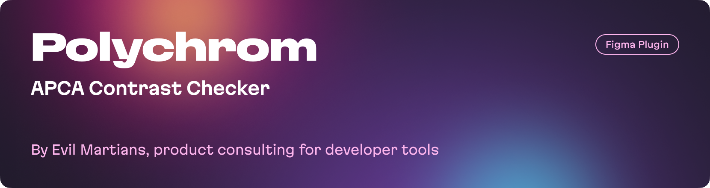

<a href="https://evilmartians.com/devtools?utm_source=figma-plugin-polychrom&utm_campaign=devtools-button&utm_medium=github"></a>

## How It Works:

- Select a layer or text with a visible solid fill, and Polychrom will display the contrast level between the selection and an automatically detected layer background.
- Select two layers with solid fills, and Polychrom will indicate the contrast between them.
- Choose multiple layers, and Polychrom will provide a list of contrasts for each selected layer and its background.
- Modify the color using the built-in color picker, and Polychrom will instantly adjust the contrast value.

## Features

- Displays the contrast level according to the APCA method.
- Offers text size recommendations for regular (weight 400) and bold (weight 700) font styles, following the APCA contrast-to-font table.
- Converts original colors to the OKLCH color model, facilitating easy copying of CSS codes to the clipboard. RGB and HEX formats are also available.

## What is APCA?

The Accessible Perceptual Contrast Algorithm (APCA) is a novel method for calculating and predicting readability contrast. This model is specially optimized for ensuring accessible color visibility on self-illuminated RGB computer displays and devices. It also addresses the requirements of visually impaired users, focusing on improving visual readability.

APCA is a candidate contrast method for the forthcoming WCAG 3 and is concurrently evolving as the APCA Readability Criterion, an independent standard managed by Inclusive Reading Technologies.

Read more: [APCA in a Nutshell](https://git.apcacontrast.com/documentation/APCA_in_a_Nutshell).

## Installation

Clone the repository:

```bash
git clone https://github.com/evilmartians/figma-polychrom.git
```

Navigate to the project directory:

```bash
cd figma-polychrom
```

Install the dependencies:

```bash
pnpm install
```

## Development

Run the development server:

```bash
pnpm dev
```

## Build

Build the plugin:

```bash
pnpm build
```

## Contributing

- Fork the repository.
- Create a new branch for your feature or bugfix.
- Make your changes.
- Push your changes and create a pull request.
- We appreciate any contributions! Please make sure to test your code and adhere to our coding standards.
